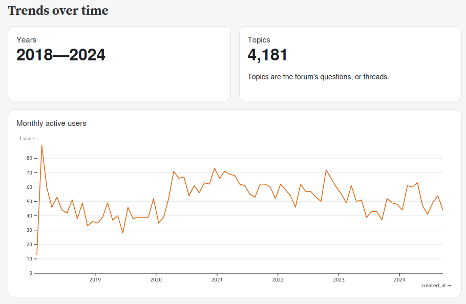
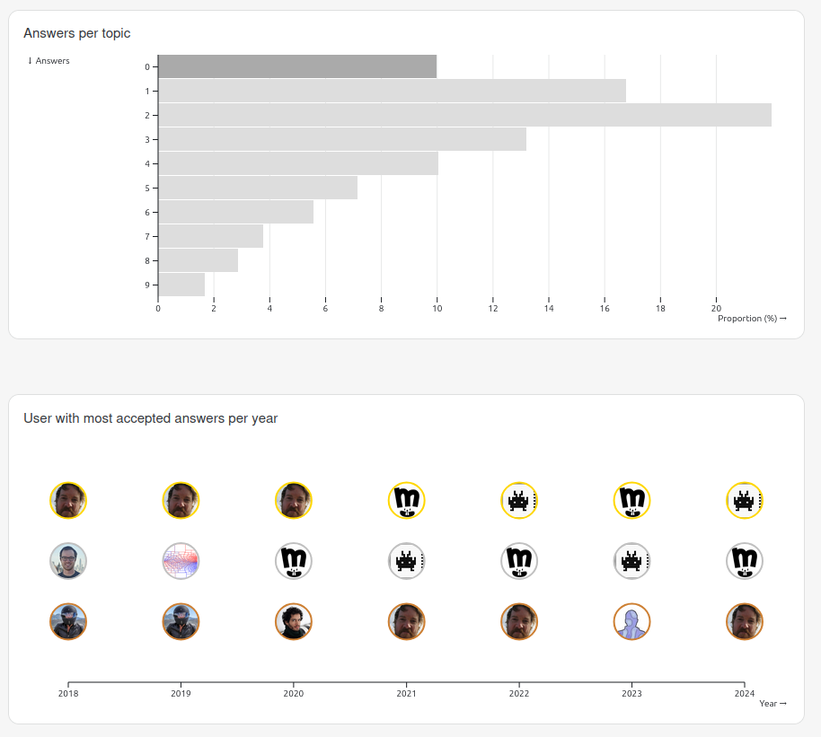

# Discourse Forum Dashboard

Dashboard of a [Discourse forum](https://discourse.org/).





This example gets the data from the Observable HQ forum (https://talk.observablehq.com), but you can switch to any other Discourse-based forum by setting the `DISCOURSE_URL` environment variable. For example, to create a dashboard for the [Hugging Face forum](https://discuss.huggingface.co), run:

```bash
npm run clean # clear the cache
DISCOURSE_URL=https://discuss.huggingface.co npm run dev
```


## Launch

The app is built with [Observable Framework](https://observablehq.com/framework). Install with:

```bash
git clone https://github.com/severo/observable-forum-dashboard.git
cd observable-forum-dashboard
npm ci
```

To start the local preview server, run:

```bash
npm run dev
```

Then visit <http://localhost:3000> to preview the app.

For more, see <https://observablehq.com/framework/getting-started>.

## Deploy

To deploy the app to Observable, see https://observablehq.com/framework/deploying. See https://severo.observablehq.cloud/observable-forum-dashboard/ for an example.

To deploy the app to an Hugging Face space, have a look at https://huggingface.co/blog/severo/build-static-html-spaces, and the deployed example: https://huggingface.co/spaces/severo/hf-forum-dashboard (the "code space" is https://huggingface.co/spaces/severo/build-hf-forum-dashboard).

## Project structure

The project looks like this:

```ini
.
├─ src
│  ├─ components
│  │  └─ fetch-and-retry.js    # utils to handle server rate limits
│  ├─ data
│  │  ├─ *.csv.js              # data loaders that fetch data from Discourse API
│  │  └─ setup.json            # <- modify to change the forum URL
│  └─ index.md                 # the dashboard
├─ .gitignore
├─ observablehq.config.js      # the app config file
├─ package.json
└─ README.md
```

## Command reference

| Command              | Description                                 |
| -------------------- | ------------------------------------------- |
| `npm install`        | Install or reinstall dependencies           |
| `npm run dev`        | Start local preview server                  |
| `npm run build`      | Build your static site, generating `./dist` |
| `npm run deploy`     | Deploy your app to Observable               |
| `npm run clean`      | Clear the local data loader cache           |
| `npm run observable` | Run commands like `observable help`         |
